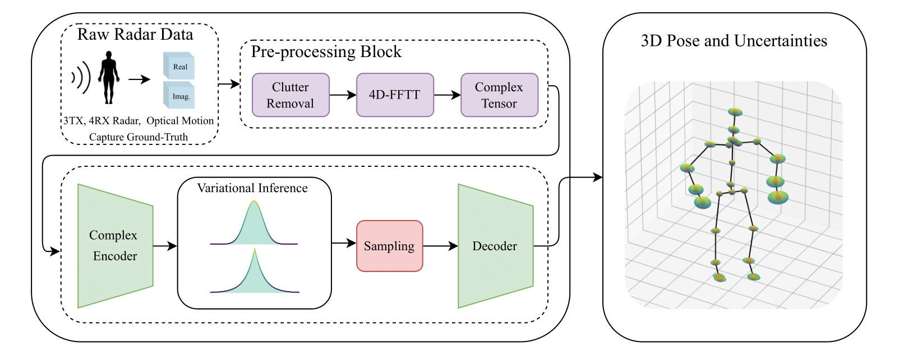

# RadProPoser: Uncertainty-Aware Human Pose Estimation and Activity Classification from Raw Radar Data
 
<div align="center">
  
</div>

## Folder Structure
The folder structure of this repository is organized as follows:

```
RadProPoser/
├── data/                  
│   ├── raw_radar_data/     
│   │   ├── radar 
│   │   ├── skeletons
│   │   ├── README.md
│   ├── data_latent   
├── models                   
├── tools 
├── trainedModels 
├── requirements.txt             

```

---

## Installation
A working installation of CUDA should be provided if GPU should be used.
To get started with the project, follow the steps below:

1. **Set up a virtual environment**:
   ```bash
   python -m venv venv
   source venv/bin/activate  
   ```

2. **Install torch with cuda_12.4**:
   ```bash
   pip3 install torch torchvision torchaudio
   ```

3. **Install additional dependencies**:
   ```bash
   pip install -r requirements.txt
   ```

4. **Download data**:
   Our data can be downloaded anonymously here: https://doi.org/10.5281/zenodo.14035103. Place our dataset in the `/data` folder. Refer to `radar_raw_data/README.md` for dataset details.

---

## Radar-based Human Pose Estimation
### 1. Create data and train the model
Change the root path in the /config.py file in /tools. The train data is automaticlly generated based on specified parameters and directories in the file. The model is trained using weights and biases (wandb) tool. You have to create an account.
Create data and train the model:
```bash
python tools/trainScript.py
```

### 2. Evaluate the Model
Run evaluation on the test set:
```bash
python tools/testing.py
```


